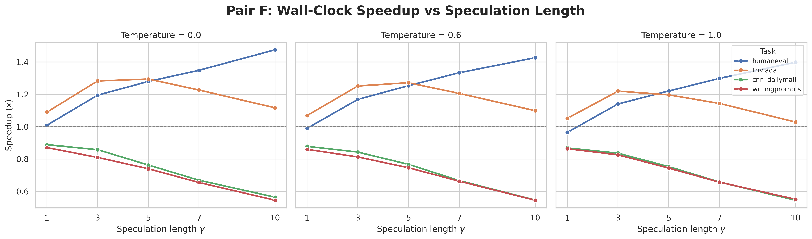
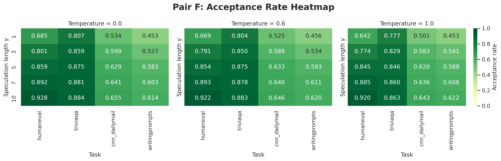
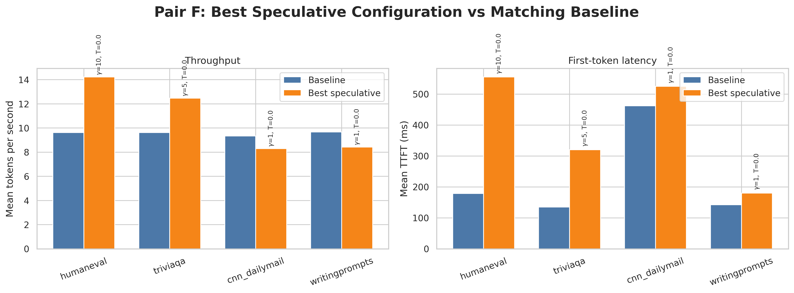
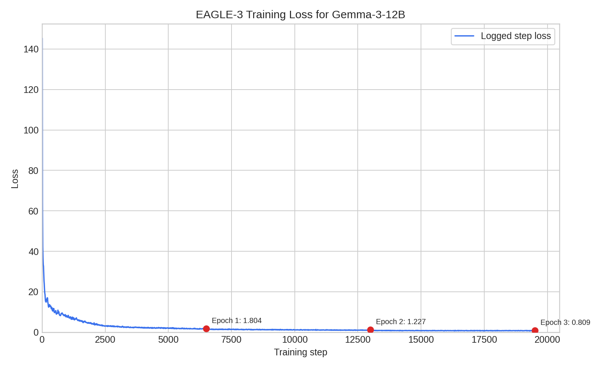
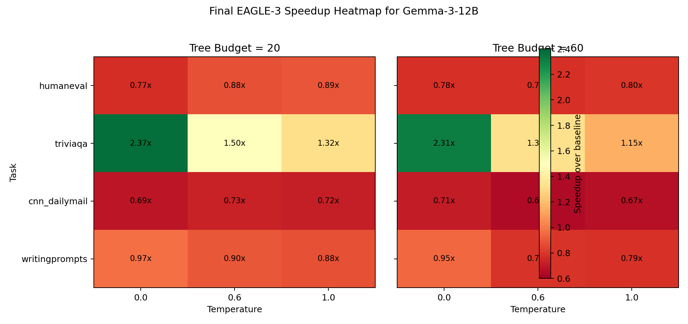
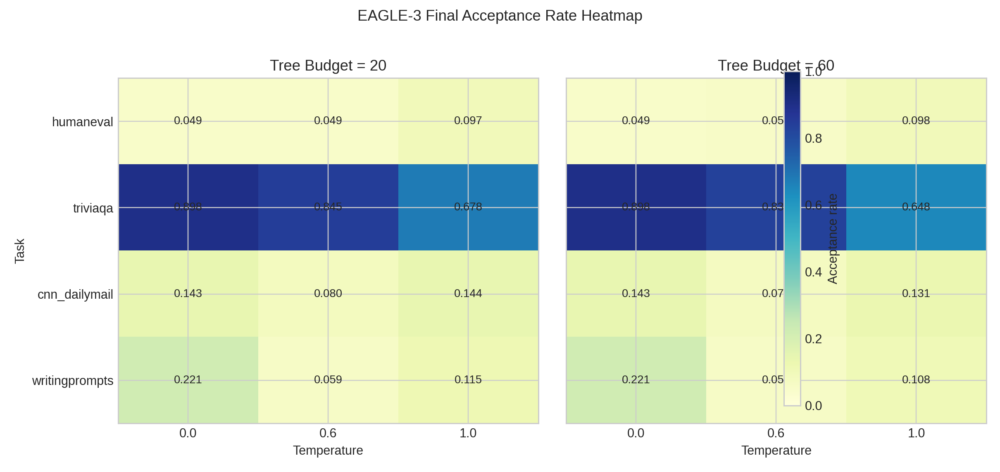
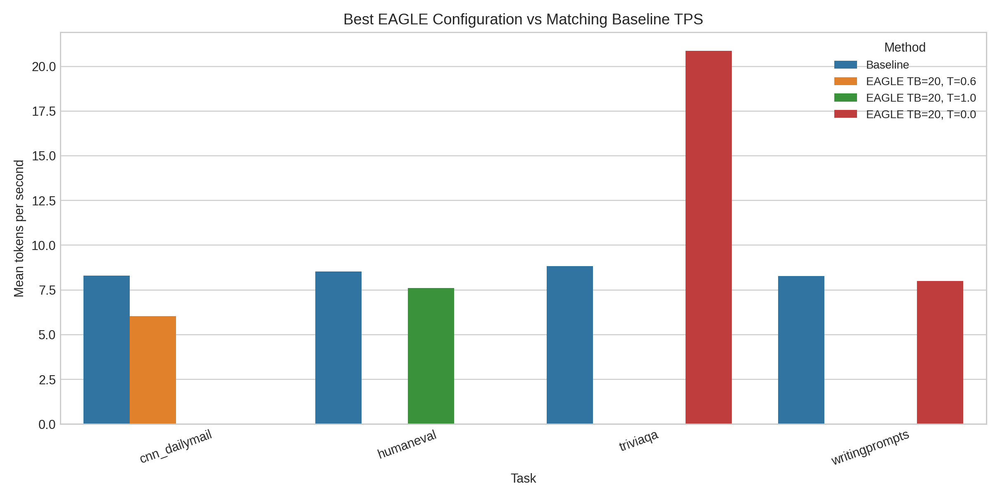
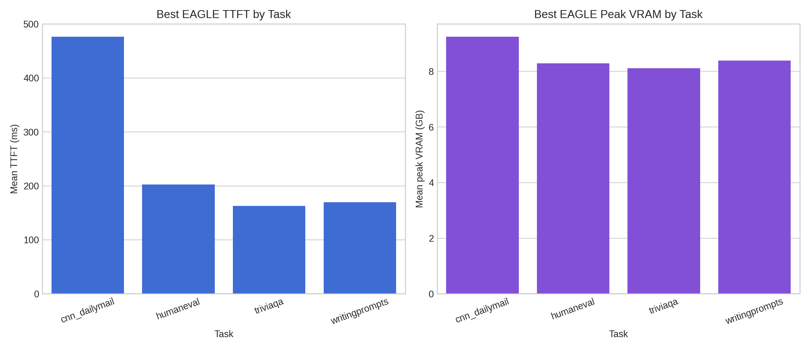

# Group Final Report

## Accelerating Gemma-3-12B Inference with Standard Speculative Decoding and EAGLE-3

## 1. Introduction

Large language models are increasingly limited not by model quality but by inference cost. Even when a target model fits comfortably on a modern GPU, autoregressive decoding remains sequential, so throughput and latency can become the bottleneck for interactive use and large-scale evaluation. This project studies two complementary acceleration strategies for the same target model, `google/gemma-3-12b-it`:

1. a standard speculative-decoding module implemented in `Code/gemma-draft-pair/`, using a smaller draft model to propose tokens for target-model verification;
2. an EAGLE-3 module implemented in `venkatesh-nagarjuna-individual-project/Code/`, using a learned draft head over target hidden states instead of a second full language model.

The purpose of the project is not to change the target model itself, but to improve inference efficiency while preserving practical reliability. The standard speculative-decoding module evaluates the classical two-model draft-and-verify design introduced by Leviathan et al. (2023). The EAGLE-3 module evaluates a more compact alternative inspired by Li et al. (2024), where future-token proposals are produced from internal target-model features rather than from a separate draft model.

This report is intentionally restricted to experiments that were actually completed and saved in the repository. In particular:

1. the fully finished standard speculative-decoding benchmark set is the pair `F` Gemma-3 run in `Code/gemma-draft-pair/gemma_runs/outputs/F_final/summary.csv`;
2. the fully finished EAGLE-3 training and inference artifacts are stored under `venkatesh-nagarjuna-individual-project/Code/artifacts/`.

The rest of the report follows the course guidelines closely. Section 2 describes the datasets. Section 3 explains the models and algorithms. Section 4 describes the experimental setup and evaluation criteria. Section 5 discusses searched hyperparameters, overfitting control, and extrapolation control. Section 6 presents the main results with figures and tables. Section 7 summarizes the conclusions and practical lessons. Section 8 lists papers, websites, and repositories used for background information or implementation support.

## 2. Description of the Data Set

### 2.1 Evaluation Datasets

Both acceleration modules were evaluated on the same four benchmark prompt collections. Each configuration used `50` prompts sampled with seed `42`.

| Task | Hugging Face dataset | Split | Prompt field | Purpose | Max prompt tokens |
| --- | --- | --- | --- | --- | --- |
| `humaneval` | `openai/openai_humaneval` | `test` | `prompt` | Code completion | 512 |
| `triviaqa` | `mandarjoshi/trivia_qa` (`rc`) | `validation` | `question` | Short-form question answering | 256 |
| `cnn_dailymail` | `abisee/cnn_dailymail` (`3.0.0`) | `test` | `article` | Summarization | 1024 |
| `writingprompts` | `euclaise/writingprompts` | `validation` | `prompt` | Creative writing continuation | 256 |

The prompt-processing pipeline applies the tokenizer's chat template when one is available and falls back to a simple `System / User / Assistant` text format otherwise. This kept evaluation consistent across model families and reduced prompt-formatting differences as a confound.

These four tasks were intentionally heterogeneous. `humaneval` rewards deterministic, syntax-sensitive continuation; `triviaqa` focuses on short-answer generation; `cnn_dailymail` stresses long-context summarization; and `writingprompts` tests longer-form open-ended generation. This mix is useful because acceleration quality depends strongly on how predictable the next-token distribution is for a given task.

### 2.2 EAGLE-3 Training Dataset

The EAGLE-3 draft head was trained on `vicgalle/alpaca-gpt4`. Each example was converted into an instruction-following chat sequence with a fixed system prompt, a user message formed from the instruction and optional input, and the reference assistant output.

| Dataset | Split | Fields used | Max sequence length | Observed training size |
| --- | --- | --- | --- | --- |
| `vicgalle/alpaca-gpt4` | `train` | `instruction`, `input`, `output` | 512 | 52,002 examples |

The completed training log confirms that `52,002` examples were prepared. Importantly, the EAGLE-3 training data is distinct from the four held-out evaluation tasks above, so the final benchmark results are not simple memorization of the supervised training set.

## 3. Description of the NLP Model and Algorithm

### 3.1 Target Model

Both modules use `google/gemma-3-12b-it` as the target model. In both cases, the target model remains the generator whose behavior we ultimately care about. The acceleration logic changes how candidate tokens are proposed and verified, but the target model remains responsible for the final sequence.

The project uses 4-bit target loading for practical GPU memory reasons. This choice does not change the task definitions or the decoding algorithms, but it makes the Gemma-3-12B target usable on an AWS `g5.2xlarge` instance with an NVIDIA A10G GPU.

The broader codebase also contains a Gemma-4-31B comparison path, even though the fully completed benchmark results in this report are centered on Gemma-3-12B. The two targets are therefore relevant at the model-context level even though they do not contribute equally to the finished experimental record.

Figure 1 summarizes the model-family context in which the acceleration methods operate. In this project, Gemma-3-12B is the main target used for the completed standard speculative-decoding and EAGLE-3 experiments. Gemma-4-31B is still relevant because the repository supports it as a larger comparison target, but it was not the center of the finished benchmark analysis reported here.

### 3.2 Standard Speculative Decoding

Standard speculative decoding uses two distributions:

1. the target distribution `p(x_t \mid x_{<t})`, produced by the large model;
2. the draft distribution `q(x_t \mid x_{<t})`, produced by the smaller model.

The draft model proposes `\gamma` future tokens, and the target model verifies them in a batched pass. A drafted token `x_t` is accepted with probability:

\[
\alpha_t = \min\left(1, \frac{p(x_t \mid x_{<t})}{q(x_t \mid x_{<t})}\right)
\]

If a proposal is rejected, the implementation samples from the residual distribution:

\[
r(x) = \frac{\max(0, p(x) - q(x))}{\sum_{x'} \max(0, p(x') - q(x'))}
\]

At `temperature = 0.0`, the code uses greedy verification instead of stochastic rejection sampling. The main benefit of the method is that the target model can verify multiple proposed positions in one forward pass. The main risk is that speedup collapses when the draft model is poorly aligned with the target and many proposals are rejected.

The completed configuration reported in this project is pair `F`.

| Pair | Target model | Draft model | Quantization | Estimated VRAM |
| --- | --- | --- | --- | --- |
| `F` | `google/gemma-3-12b-it` | `google/gemma-3-1b-it` | 4-bit target, BF16 draft | about 8.6 GB |

This module required no training. Its algorithmic development came from adapting the speculative-decoding literature to Gemma-specific engineering constraints such as KV-cache handling, preallocated token buffers, 4-bit target loading, and detailed timing and VRAM instrumentation.

Figure 2 illustrates the core intuition behind standard speculative decoding: if the draft model is often correct, then several future tokens can be proposed cheaply and verified in fewer expensive target-model passes. The completed pair `F` experiments test exactly how often that assumption holds for Gemma-3-12B paired with Gemma-3-1B.

### 3.3 EAGLE-3 Draft-Head Acceleration

EAGLE-3 removes the separate draft model and replaces it with a learned draft head operating on the target model's hidden states. In the completed implementation, the draft head uses:

1. hidden states from three target layers;
2. a fusion projection over those three feature streams;
3. the target embedding layer for the currently verified token;
4. an input projection that combines token and feature information;
5. one copied decoder layer;
6. the frozen target normalization and LM head.

If the hidden states selected from the low-, mid-, and high-level layers are denoted by `h_low`, `h_mid`, and `h_high`, then the fused representation is

\[
h_{\text{fused}} = W_f [h_{\text{low}}; h_{\text{mid}}; h_{\text{high}}]
\]

and the decoder-layer input is

\[
z_t = W_{\text{in}} [e(x_t); h_{\text{fused}, t}]
\]

where `e(x_t)` is the embedding of the current token.

The training objective is a multi-step KL-divergence loss:

\[
\mathcal{L} = \sum_{k=0}^{K-1} \lambda^k \, KL\left(p^{(k)}_{\text{target}} \parallel p^{(k)}_{\text{draft}}\right)
\]

with default multi-step horizon `K = 5` and decay `\lambda = 0.8`.

This objective is important because EAGLE-3 is not only trying to match the target's next-token distribution at one step. It is also trying to remain stable after its own predictions are fed back in future steps. In other words, the multi-step loss is explicitly designed to reduce compounding error during extrapolation.

The completed production configuration is pair `I`.

| Pair | Target model | Draft component | Quantization |
| --- | --- | --- | --- |
| `I` | `google/gemma-3-12b-it` | trained EAGLE-3 draft head | 4-bit target |

The decode path used in this repository is a best-path EAGLE-3 variant rather than a full masked-tree verification implementation. The code samples a root token from the target, expands a draft tree from fused hidden features, extracts candidate paths, chooses the best path, and verifies that path sequentially with the target model.

Figure 3 is not a literal diagram of the exact code path in this repository. Instead, it provides the high-level conceptual background for EAGLE-style acceleration: future-token proposals are generated from internal target-model representations rather than from a second full language model. The project’s EAGLE-3 implementation specializes this idea to a Gemma-3-12B target with a learned fused-feature draft head.

## 4. Experimental Setup

### 4.1 Hardware and Software Framework

The project was implemented in Python using PyTorch and Hugging Face Transformers, with Hugging Face Datasets for benchmark loading and bitsandbytes for 4-bit target quantization and 8-bit optimizer support. Plotting used Matplotlib and Seaborn.

The EAGLE-3 training and evaluation logs explicitly record an NVIDIA A10G GPU, consistent with the AWS `g5.2xlarge` hardware target used throughout the project. This is a realistic setting for model-serving experiments because it forces memory-efficient design decisions rather than relying on a very large accelerator.

### 4.2 Standard Speculative-Decoding Protocol

The completed standard speculative benchmark for pair `F` used:

1. `\gamma \in \{1, 3, 5, 7, 10\}`;
2. `temperature \in \{0.0, 0.6, 1.0\}`;
3. `4` tasks;
4. `50` prompts per configuration;
5. `128` maximum generated tokens;
6. `3` warm-up generations before measurement.

This yields `60` speculative configurations and `12` matching baselines, for `72` saved rows in the completed summary file.

### 4.3 EAGLE-3 Training Protocol

The completed EAGLE-3 training run used:

1. `google/gemma-3-12b-it` as a frozen 4-bit target;
2. the Alpaca-GPT4 instruction dataset described in Section 2.2;
3. BF16 mixed precision for the trainable head;
4. 8-bit AdamW when available;
5. gradient accumulation and gradient clipping;
6. periodic checkpointing every `500` steps.

The finished log shows that the run resumed from `step5000` and completed at `step19503`. The active GPU training time across the two logged sessions was `36.98` hours.

### 4.4 EAGLE-3 Evaluation Protocol

The completed EAGLE-3 inference sweep used:

1. `tree_budget \in \{20, 60\}`;
2. `temperature \in \{0.0, 0.6, 1.0\}`;
3. the same `4` evaluation tasks;
4. `50` prompts per configuration;
5. `128` maximum generated tokens;
6. `3` warm-up generations before measurement.

This yields `24` EAGLE configurations and `12` matching baselines, for `36` rows in the finished summary file.

The long-context `cnn_dailymail` cases were particularly important because they stress KV-cache management. The targeted rerun log for the `cnn_dailymail` fix shows that the implementation can fall back to uncached verification when cache-shape mismatches occur. This fallback preserves correctness but reduces speed, which becomes relevant in the final results.

### 4.5 Performance Criteria and Correctness Checks

The project evaluated performance primarily as a systems problem. The two main metrics were tokens per second and speedup over the matching baseline:

\[
TPS = \frac{\text{total generated tokens}}{\text{wall-clock time}}
\]

\[
Speedup = \frac{TPS_{\text{accelerated}}}{TPS_{\text{baseline}}}
\]

The code also logged:

1. time to first token (TTFT),
2. mean acceptance rate,
3. mean acceptance length,
4. draft-overhead ratio,
5. peak VRAM.

In addition to these metrics, the codebase includes correctness and smoke-test scripts. The standard speculative module includes unit tests and greedy-equivalence tests. The EAGLE module includes unit tests for tree logic and smoke tests for the active pair `I`. The final report emphasizes the completed benchmark outputs, but these tests were useful for ensuring the accelerators were not simply fast because they were broken.

## 5. Hyperparameter Search, Overfitting, and Extrapolation Control

### 5.1 Searched Hyperparameters

The searched hyperparameters were different for the two modules.

| Module | Searched hyperparameters | Values |
| --- | --- | --- |
| Standard speculative decoding | Speculation length `\gamma` | `1, 3, 5, 7, 10` |
| Standard speculative decoding | Temperature | `0.0, 0.6, 1.0` |
| EAGLE-3 inference | Tree budget | `20, 60` |
| EAGLE-3 inference | Temperature | `0.0, 0.6, 1.0` |

The EAGLE-3 training run did not perform a large hyperparameter sweep because training even a lightweight draft head on Gemma-3-12B is expensive. Instead, one practical configuration was chosen and monitored carefully.

| EAGLE-3 training setting | Active value |
| --- | --- |
| Learning rate | `3e-4` |
| Batch size | `1` |
| Gradient accumulation | `8` |
| Weight decay | `0.01` |
| Max sequence length | `512` |
| Multi-step horizon `K` | `5` |
| Multi-step decay `\lambda` | `0.8` |

### 5.2 Overfitting Prevention and Detection

Overfitting affects the two modules differently.

For standard speculative decoding, there is no trainable component, so overfitting in the usual supervised-learning sense does not apply. The main concern is draft-target mismatch rather than training-set memorization.

For EAGLE-3 training, the project used several practical controls:

1. weight decay and gradient clipping to reduce unstable parameter growth;
2. warmup and cosine decay to stabilize optimization;
3. periodic checkpoints so runs could be resumed rather than restarted;
4. evaluation on four held-out benchmark datasets that differ substantially from Alpaca-GPT4.

The project did not run a separate validation-perplexity study for the draft head. That is a real limitation. Overfitting detection therefore relied on two signals: the smooth downward training-loss curve and the fact that downstream inference was evaluated on held-out tasks from a different data distribution.

### 5.3 Extrapolation and Compounding-Error Control

Extrapolation is especially important for acceleration methods because both the draft model and the EAGLE draft head are asked to predict future tokens before the target model sees them.

The project addressed this in different ways:

1. Standard speculative decoding uses target-model verification at every round. Poor draft proposals can be rejected immediately.
2. EAGLE-3 uses a multi-step KL objective so the head learns to recover after its own predictions are fed back in future steps.
3. The EAGLE implementation includes a long-context fallback path that switches to uncached verification when KV-cache trimming becomes unreliable.

This last point matters in practice. The `cnn_dailymail` rerun log shows frequent uncached-fallback warnings at long contexts. The fallback preserves functional correctness, but it also explains part of the throughput loss on summarization tasks.

## 6. Results

### 6.1 Standard Speculative-Decoding Results

The completed pair `F` benchmark is the strongest finished standard speculative artifact in the repository and serves as the main evidence for Module 1.

Table 1 summarizes the best speculative configuration for each task together with the matching baseline.

| Task | Matching baseline TPS | Best speculative config | Best speculative TPS | Speedup | Mean acceptance rate | Baseline TTFT (ms) | Best TTFT (ms) | Peak VRAM (GB) |
| --- | --- | --- | --- | --- | --- | --- | --- | --- |
| `humaneval` | 9.63 | `\gamma = 10`, `T = 0.0` | 14.22 | 1.476 | 0.9279 | 179.12 | 555.24 | 9.40 |
| `triviaqa` | 9.63 | `\gamma = 5`, `T = 0.0` | 12.47 | 1.295 | 0.8751 | 134.99 | 320.48 | 9.31 |
| `cnn_dailymail` | 9.34 | `\gamma = 1`, `T = 0.0` | 8.30 | 0.889 | 0.5342 | 462.10 | 525.01 | 9.77 |
| `writingprompts` | 9.68 | `\gamma = 1`, `T = 0.0` | 8.43 | 0.871 | 0.4525 | 142.32 | 180.03 | 9.32 |

The main conclusion from Table 1 is that pair `F` is useful but not universally useful. It produces strong gains on `humaneval` and `triviaqa`, but not on `cnn_dailymail` or `writingprompts`.

Figure 4 shows that speedup improves with larger `\gamma` only when draft-target agreement remains strong. For `humaneval`, speedup increases steadily up to `1.476x` at `\gamma = 10`. For `triviaqa`, the optimum occurs earlier at `\gamma = 5`. In contrast, `cnn_dailymail` and `writingprompts` degrade as `\gamma` increases because more aggressive speculative proposals produce too much verification waste.

Figure 5 explains the pattern in Figure 4. Acceptance is consistently high on `humaneval` and `triviaqa`, especially at larger `\gamma`, but substantially lower on `cnn_dailymail` and `writingprompts`. The strongest speedups occur where acceptance is both high and stable. Low acceptance does not simply reduce marginal gains; it can erase them entirely.

Figure 6 shows the central trade-off of standard speculative decoding. The same settings that improve throughput also increase first-token latency. The gain on `humaneval` and `triviaqa` is real and substantial, but it comes with noticeably worse TTFT. This means pair `F` is more attractive for long-form or sustained generation than for applications where first-token responsiveness is the primary objective.

Across the full finished sweep, peak VRAM remained below `10 GB`, so pair `F` is operationally lightweight on an A10G. This is an important positive result: even though speculative decoding is not beneficial on every task, the cost of trying it on Gemma-3-12B is modest from a memory perspective.

### 6.2 EAGLE-3 Training Results

The EAGLE-3 training artifacts provide a clear record of successful optimization rather than an incomplete training attempt.

Table 2 summarizes the completed run.

| Item | Observed value |
| --- | --- |
| Target model | `google/gemma-3-12b-it` |
| Logged hardware | `NVIDIA A10G` |
| Prepared training examples | `52,002` |
| Trainable parameters | `297,876,992` |
| Optimizer | 8-bit AdamW |
| Final checkpoint step | `19,503` |
| Resume point | `step5000` |
| Active GPU training time | `36.98` hours |
| Final checkpoint | `eagle3_gemma3_12b_final.pt` |

Selected loss milestones are shown in Table 3.

| Milestone | Loss |
| --- | --- |
| Step 10 | 145.2908 |
| Step 100 | 21.2564 |
| Step 500 | 9.7899 |
| Epoch 1 average loss | 1.8044 |
| Epoch 2 average loss | 1.2272 |
| Step 19,000 | 0.7941 |
| Epoch 3 average loss | 0.8095 |

Figure 7 shows a very steep initial loss drop followed by a long convergence tail. This is the behavior expected from a large supervised approximation problem: the head quickly learns coarse alignment with the target distribution and then spends most of the remaining optimization budget improving fine-grained agreement. The end of the run remains well below `1.0` average loss, which is strong evidence that the head became a useful proposal mechanism rather than a random extrapolator.

The training result is important because it establishes that the project did not stop at benchmarking a training-free baseline. The EAGLE-3 module was trained end to end, resumed successfully after an interruption, and finished with a saved final checkpoint.

### 6.3 EAGLE-3 Inference Results

The completed EAGLE-3 inference sweep provides a full task-by-task comparison against matching baselines. Table 4 summarizes the best EAGLE configuration for each task.

| Task | Best tree budget | Best temperature | Matching baseline TPS | Best EAGLE TPS | Speedup | Mean acceptance rate | Matching baseline TTFT (ms) | Best EAGLE TTFT (ms) | Best EAGLE peak VRAM (GB) |
| --- | --- | --- | --- | --- | --- | --- | --- | --- | --- |
| `humaneval` | 20 | 1.0 | 8.52 | 7.61 | 0.893 | 0.0974 | 203.77 | 202.53 | 8.29 |
| `triviaqa` | 20 | 0.0 | 8.82 | 20.87 | 2.368 | 0.8977 | 162.03 | 162.60 | 8.11 |
| `cnn_dailymail` | 20 | 0.6 | 8.30 | 6.03 | 0.727 | 0.0803 | 475.55 | 476.55 | 9.25 |
| `writingprompts` | 20 | 0.0 | 8.27 | 8.01 | 0.969 | 0.2206 | 172.87 | 169.72 | 8.39 |

Table 4 shows a much more uneven task profile than the training-loss curve alone would suggest. `triviaqa` is an excellent fit for the trained EAGLE-3 head, but `humaneval`, `cnn_dailymail`, and `writingprompts` remain below or near baseline.

Figure 8 makes the task dependence of EAGLE-3 especially clear. `triviaqa` is the standout case, peaking at `2.368x` speedup for `tree_budget = 20` and `temperature = 0.0`. `writingprompts` comes close to parity, `humaneval` improves somewhat at higher temperatures but remains below `1.0x`, and `cnn_dailymail` remains well below baseline throughout the sweep.

An additional practical finding from Figure 8 is that `tree_budget = 20` outperforms `tree_budget = 60` for every task's best finished result. Larger trees did not help once verification cost was included.

Figure 9 explains why `triviaqa` is the only task with a large EAGLE speedup. Its acceptance rate is far higher than the other tasks, especially at low temperature. `humaneval` is the opposite extreme: it achieves very low acceptance even when its TTFT remains competitive with baseline. `cnn_dailymail` and `writingprompts` sit in the middle but do not maintain enough agreement to overcome verification overhead.

Figure 10 provides the clearest direct comparison between EAGLE and baseline throughput. The `triviaqa` improvement is not marginal; it is the dominant success case of the entire EAGLE study. At the same time, the figure also shows that the method should not be treated as uniformly beneficial. The same draft head that works extremely well on `triviaqa` is a net slowdown on summarization.

Figure 11 shows that the best EAGLE configurations remain practical from a deployment perspective. TTFT stays in roughly the same scale as baseline for all tasks, and peak VRAM remains in the `8.11` to `9.25 GB` range. The slowdown on `cnn_dailymail` is therefore not a memory-capacity issue. It is primarily an acceptance-and-verification issue, made worse by long-context fallback behavior.

The targeted `cnn_dailymail` rerun log supports this interpretation. It shows repeated uncached-verification warnings at long contexts, followed by successful completion. In other words, the current implementation prioritizes correctness and robustness over raw speed when the cache path becomes unreliable. This is the right engineering choice, but it also explains why summarization remains the hardest case.

## 7. Summary and Conclusions

This project produced two useful and complementary conclusions about inference acceleration for Gemma-3-12B.

First, standard speculative decoding with a separate small draft model is already effective on some tasks. Pair `F` achieved the strongest finished result in the repository on `humaneval`, where the best configuration reached `1.476x` speedup, and it also improved `triviaqa` to `1.295x`. These gains were strongly correlated with high acceptance rates. However, the same method slowed down `cnn_dailymail` and `writingprompts`, demonstrating that speculative decoding is only worthwhile when the draft model tracks the target closely enough.

Second, the EAGLE-3 draft-head approach is viable and can outperform standard drafting on selected tasks while using only the target model and a lightweight learned head. The completed training run converged successfully, produced a final checkpoint, and yielded a striking `2.368x` speedup on `triviaqa`. That is the best acceleration result in the entire project. At the same time, the EAGLE results also show that a trained hidden-state extrapolator is not universally strong across domains. Long-context summarization remains difficult, and low-acceptance tasks still pay too much verification overhead.

The most important lessons from the project are:

1. draft-target agreement is the dominant driver of speedup;
2. throughput gains and first-token latency do not necessarily improve together;
3. a lightweight learned draft head can be more effective than a separate draft model on the right task;
4. cache management and long-context robustness matter as much as the nominal decoding algorithm;
5. realistic GPU-memory limits force design choices that are central rather than incidental.

The most natural future improvements are:

1. adding a validation-driven EAGLE training study rather than relying on one production training configuration;
2. improving long-context verification so `cnn_dailymail` does not rely on slow fallback behavior;
3. investigating whether task-adaptive tree budgets or confidence thresholds can improve EAGLE robustness;
4. expanding pair-`F` style speculative experiments with more systematically matched draft models.

Overall, the project shows that Gemma-3-12B inference can be accelerated substantially, but only when the proposal mechanism matches the task structure. There is no single universally best accelerator. Instead, the finished experiments support a more nuanced conclusion: standard speculative decoding is a practical low-risk baseline, while EAGLE-3 offers the most exciting upside when the hidden-state extrapolator is well aligned with the target distribution.

## 8. References

1. Leviathan, Y., Kalman, M., and Matias, Y. *Fast Inference from Transformers via Speculative Decoding.* ICML 2023. https://arxiv.org/abs/2302.01318
2. Li, Y., Wei, F., Zhang, C., and Zhang, H. *EAGLE: Speculative Sampling Requires Rethinking Feature Uncertainty.* ICML 2024. https://arxiv.org/abs/2401.15077
3. Gemma Team. *Gemma 3 Technical Report.* Google DeepMind, 2025. https://storage.googleapis.com/deepmind-media/gemma/Gemma3Report.pdf
4. SafeAILab EAGLE repository. https://github.com/SafeAILab/EAGLE
5. PyTorch repository. https://github.com/pytorch/pytorch
6. Hugging Face Transformers repository. https://github.com/huggingface/transformers
7. bitsandbytes repository. https://github.com/bitsandbytes-foundation/bitsandbytes
8. Streamlit repository. https://github.com/streamlit/streamlit
9. Hugging Face model card: `google/gemma-3-1b-it`. https://huggingface.co/google/gemma-3-1b-it
10. Hugging Face model card: `google/gemma-3-12b-it`. https://huggingface.co/google/gemma-3-12b-it
11. Hugging Face dataset: `openai/openai_humaneval`. https://huggingface.co/datasets/openai/openai_humaneval
12. Hugging Face dataset: `mandarjoshi/trivia_qa`. https://huggingface.co/datasets/mandarjoshi/trivia_qa
13. Hugging Face dataset: `abisee/cnn_dailymail`. https://huggingface.co/datasets/abisee/cnn_dailymail
14. Hugging Face dataset: `euclaise/writingprompts`. https://huggingface.co/datasets/euclaise/writingprompts
15. Hugging Face dataset: `vicgalle/alpaca-gpt4`. https://huggingface.co/datasets/vicgalle/alpaca-gpt4
