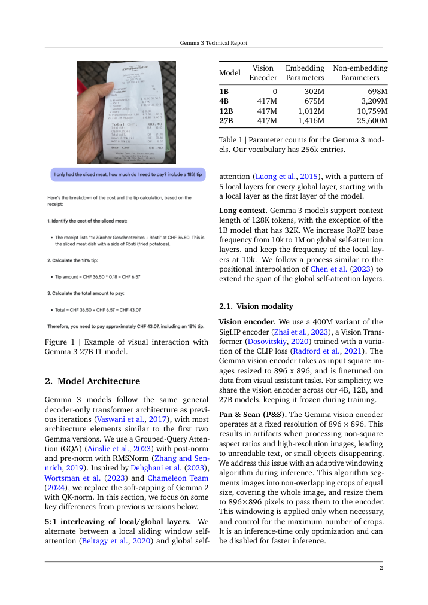

# Group Final Report

## Accelerating Gemma Inference with Standard Speculative Decoding and EAGLE-3

## 1. Introduction

This project investigates two inference-acceleration modules for Gemma models:

1. `Code/gemma-draft-pair/`
   Standard speculative decoding for pair `F`, using `google/gemma-3-12b-it` as the target model and `google/gemma-3-1b-it` as the draft model.
2. `Code/eagle3-gemma3-12B/`
   EAGLE-3 draft-head training and inference for `google/gemma-3-12b-it`, where a learned draft head replaces the separate draft model.

The overall goal is to reduce decoding latency and increase throughput without changing the target model's output distribution. The first module evaluates the classical target-draft speculative decoding setup. The second module studies a more compact approach, EAGLE-3, which predicts future tokens from the target model's hidden states instead of from a second full language model.

This report is written around the actual repository state. It reports completed pair `F` benchmark results, completed EAGLE-3 training results, and the currently available partial EAGLE evaluation outputs. Missing final EAGLE inference results are left as placeholders rather than guessed.

## 2. Shared Data, Model Context, and Evaluation Framework

### 2.1 Evaluation Datasets

Both modules evaluate on the same four prompt sets defined in `data.py`. Each configuration uses `50` prompts sampled with seed `42`.

| Task | Hugging Face Dataset | Split | Prompt Field | Purpose | Max Prompt Tokens |
| --- | --- | --- | --- | --- | --- |
| `humaneval` | `openai/openai_humaneval` | `test` | `prompt` | Code completion | 512 |
| `triviaqa` | `mandarjoshi/trivia_qa` (`rc`) | `validation` | `question` | Question answering | 256 |
| `cnn_dailymail` | `abisee/cnn_dailymail` (`3.0.0`) | `test` | `article` | Summarization | 1024 |
| `writingprompts` | `euclaise/writingprompts` | `validation` | `prompt` | Creative writing | 256 |

The code first applies the model tokenizer's chat template when available and falls back to a simple `System/User/Assistant` text template otherwise.

### 2.2 EAGLE-3 Training Data

The EAGLE-3 training script uses `vicgalle/alpaca-gpt4`. Each example is turned into a chat-formatted instruction-following sequence with a fixed system message, a user instruction, and the reference assistant output.

| Dataset | Split | Fields Used | Max Sequence Length | Observed Training Size |
| --- | --- | --- | --- | --- |
| `vicgalle/alpaca-gpt4` | `train` | `instruction`, `input`, `output` | 512 | 52,002 examples |

The training log confirms that `52,002` examples were prepared.

### 2.3 Gemma 3 Model Context

Both modules are built around `google/gemma-3-12b-it`, so the public Gemma 3 architecture context is relevant to the entire project. Figure 1 comes from the official Gemma 3 technical report and summarizes the architecture section for the Gemma 3 family used in this project.

Figure 1 is not a custom diagram. It is a rendered page from the official Gemma 3 technical report. For this project, the most relevant model is the 12B instruction-tuned variant. The report page highlights three model-family details that matter here:

1. Gemma 3 uses a decoder-only transformer family design.
2. The 12B model shares the same core family design as the other Gemma 3 text models.
3. The family introduces longer context support and a local/global attention pattern that is relevant to memory-efficient inference.

### 2.4 Evaluation Metrics

Both modules measure performance using the same core metrics:

\[
TPS = \frac{\text{total generated tokens}}{\text{wall-clock time}}
\]

\[
Speedup = \frac{TPS_{accelerated}}{TPS_{baseline}}
\]

The code also records:

1. `TTFT` (time to first token),
2. acceptance rate,
3. acceptance length,
4. draft overhead ratio,
5. peak VRAM.

## 3. Module 1: Standard Speculative Decoding (`gemma-draft-pair`)

### 3.1 Objective

The first module measures whether a small Gemma draft model can speed up decoding for a larger Gemma target model.

Active configuration:

| Pair | Target Model | Draft Model | Quantization | Estimated VRAM |
| --- | --- | --- | --- | --- |
| `F` | `google/gemma-3-12b-it` | `google/gemma-3-1b-it` | 4-bit target, BF16 draft | about 8.6 GB |

### 3.2 Algorithm Background

Standard speculative decoding uses two distributions:

1. `p(x_t | x_{<t})`, the target distribution,
2. `q(x_t | x_{<t})`, the draft distribution.

The draft model proposes `gamma` tokens, and the target model verifies them in a batched step. A drafted token `x_t` is accepted with probability:

\[
\alpha_t = \min\left(1, \frac{p(x_t \mid x_{<t})}{q(x_t \mid x_{<t})}\right)
\]

If the token is rejected, the algorithm samples from the residual distribution:

\[
r(x) = \frac{\max(0, p(x) - q(x))}{\sum_{x'} \max(0, p(x') - q(x'))}
\]

At `temperature = 0.0`, the implementation uses greedy verification instead of stochastic rejection sampling.

Figure 2 is an internet-sourced assisted-generation visual from the Hugging Face blog. It is not specific to Gemma, but it accurately illustrates the high-level draft-then-verify process used by standard speculative decoding.

<video controls width="100%" src="https://huggingface.co/datasets/huggingface/documentation-images/resolve/main/blog/assisted-generation/gif_4_1080p.mov"></video>

Figure 2. Public assisted-generation animation showing the high-level speculative-decoding loop: the assistant or draft model proposes candidate tokens, and the larger model verifies them. Source: Hugging Face blog, "Assisted Generation: a new direction toward low-latency text generation."

The implementation in `speculative.py` adds several practical optimizations:

1. KV-cache reuse for both models,
2. pre-allocated token buffers,
3. vectorized batch rejection sampling,
4. detailed timing and VRAM instrumentation.

### 3.3 Experimental Setup

The completed pair `F` sweep stored in `Code/gemma-draft-pair/gemma_runs/outputs/F_final/summary.csv` used:

1. `gamma = {1, 3, 5, 7, 10}`,
2. `temperature = {0.0, 0.6, 1.0}`,
3. `4` benchmark tasks,
4. `50` prompts per configuration,
5. `128` maximum generated tokens,
6. `3` warmup generations.

This produced `12` baseline rows and `60` speculative rows, for `72` total result rows.

### 3.4 Hyperparameters

| Hyperparameter | Values |
| --- | --- |
| `gamma` | `1, 3, 5, 7, 10` |
| `temperature` | `0.0, 0.6, 1.0` |
| `task` | `humaneval`, `triviaqa`, `cnn_dailymail`, `writingprompts` |

Other fixed settings:

| Setting | Value |
| --- | --- |
| `max_new_tokens` | 128 |
| `num_prompts` | 50 |
| `num_warmup` | 3 |
| `seed` | 42 |

### 3.5 Results

The completed pair `F` result set is the strongest finished benchmark artifact in the repository.

| Task | Best `gamma` | Best `temperature` | Mean TPS | Speedup | Mean Acceptance Rate | Mean Acceptance Length | Mean TTFT (ms) | Mean Peak VRAM (GB) |
| --- | --- | --- | --- | --- | --- | --- | --- | --- |
| `humaneval` | 10 | 0.0 | 14.22 | 1.476 | 0.9279 | 6.03 | 555.24 | 9.40 |
| `triviaqa` | 5 | 0.0 | 12.47 | 1.295 | 0.8751 | 2.96 | 320.48 | 9.31 |
| `cnn_dailymail` | 1 | 0.0 | 8.30 | 0.889 | 0.5342 | 0.53 | 525.01 | 9.77 |
| `writingprompts` | 1 | 0.0 | 8.43 | 0.871 | 0.4525 | 0.45 | 180.03 | 9.32 |

Baseline reference values at `temperature = 0.0` are:

| Task | Baseline TPS | Baseline TTFT (ms) | Baseline Peak VRAM (GB) |
| --- | --- | --- | --- |
| `humaneval` | 9.63 | 179.12 | 9.32 |
| `triviaqa` | 9.63 | 134.99 | 9.26 |
| `cnn_dailymail` | 9.34 | 462.10 | 9.75 |
| `writingprompts` | 9.68 | 142.32 | 9.27 |

The main findings are:

1. Pair `F` produces real speedups on `humaneval` and `triviaqa`.
2. The best overall result is `1.476x` speedup on `humaneval` at `gamma = 10`.
3. The method remains slower than baseline on `cnn_dailymail` and `writingprompts`.
4. Pair `F` remains practical on an A10G, with peak VRAM below `10 GB` across the completed sweep.

Figure 3 shows how speedup changes with `gamma` across the completed pair `F` and legacy comparison runs.

Figure 3 shows that larger `gamma` values are helpful only when the draft model remains aligned with the target. For pair `F`, `humaneval` and `triviaqa` benefit from longer speculative proposals, while the other two tasks do not.

Figure 4 explains this through acceptance behavior.

Figure 4 shows that acceptance is much stronger on `humaneval` and `triviaqa` than on `cnn_dailymail` and `writingprompts`. This is the main reason the first two tasks gain speed while the latter two lose speed.

Figure 5 highlights the throughput versus latency trade-off.

Figure 5 shows that the settings with the strongest throughput gains also increase TTFT substantially. For example, the best `humaneval` speedup comes with a much higher TTFT than baseline. This means pair `F` is attractive for sustained token generation, but not necessarily for minimizing first-token latency.

## 4. Module 2: EAGLE-3 Draft Head for Gemma-3-12B (`eagle3-gemma3-12B`)

### 4.1 Objective

The second module removes the separate draft model and replaces it with a learned draft head that operates directly on the target model's hidden states.

Active configuration:

| Pair | Target Model | Draft Component | Quantization |
| --- | --- | --- | --- |
| `I` | `google/gemma-3-12b-it` | trained EAGLE-3 draft head | 4-bit target |

### 4.2 Model and Algorithm

The EAGLE-3 implementation in `eagle3.py` uses:

1. hidden states from three target layers,
2. a fusion projection,
3. the target embedding layer,
4. an input projection,
5. one copied decoder layer,
6. the frozen target normalization and LM head.

The fused representation is:

\[
h_{fused} = W_f [h_{low}; h_{mid}; h_{high}]
\]

The decoder input is:

\[
z_t = W_{in}[e(x_t); h_{fused,t}]
\]

The training objective is a multi-step KL-divergence loss:

\[
\mathcal{L} = \sum_{k=0}^{K-1} \lambda^k \, KL\left(p^{(k)}_{target} \parallel p^{(k)}_{draft}\right)
\]

with default `K = 5` and `lambda = 0.8`.

Figure 6 is an official EAGLE figure from the public EAGLE repository. It illustrates the original EAGLE feature-extrapolation idea that the EAGLE-3 implementation builds on, although the repository here extends it to the EAGLE-3 fused-feature setup.

The active decode path in this repository does not use a full masked tree verification pass. Instead, it:

1. samples a root token from the target,
2. builds a draft tree from fused hidden features,
3. extracts candidate paths,
4. selects the best path,
5. verifies that path sequentially with the target model.

This best-path verification approach is what the current implementation actually runs.

### 4.3 Training Setup and Hyperparameters

The completed training run used:

1. `google/gemma-3-12b-it` as the frozen target,
2. 4-bit target loading,
3. BF16 mixed precision,
4. 8-bit AdamW when available,
5. gradient accumulation,
6. warmup and cosine learning-rate decay,
7. gradient clipping,
8. checkpoint saving every `500` steps.

Key exposed or observed hyperparameters are:

| Hyperparameter | Observed Default or Active Value |
| --- | --- |
| Learning rate | `3e-4` |
| Batch size | `1` |
| Gradient accumulation | `8` |
| Weight decay | `0.01` |
| Max sequence length | `512` |
| Multi-step horizon `K` | `5` |

The final checkpoint exists at:

`Code/eagle3-gemma3-12B/checkpoints/eagle3/gemma3_12b/eagle3_gemma3_12b_final.pt`

The training log records completion at `2026-04-27 18:13:37`.

### 4.4 Training Results

The EAGLE-3 training artifacts provide a clear record of successful optimization.

| Item | Observed Value |
| --- | --- |
| Logged target model | `google/gemma-3-12b-it` |
| Logged hardware | `NVIDIA A10G` |
| Prepared examples | `52,002` |
| Trainable parameters | `297,876,992` |
| Optimizer | 8-bit AdamW |
| Final checkpoint | `eagle3_gemma3_12b_final.pt` |
| Training completion time | `2026-04-27 18:13:37` |

Selected loss milestones are:

| Milestone | Loss |
| --- | --- |
| Step 10 | 145.2908 |
| Step 100 | 21.2564 |
| Step 500 | 9.7899 |
| Epoch 1 average loss | 1.8044 |
| Epoch 2 average loss | 1.2272 |
| Step 19,000 | 0.7941 |
| Epoch 3 average loss | 0.8095 |

Figure 7 plots the logged training loss from the completed run.

Figure 7 shows a steep early drop in loss followed by a much slower convergence phase. The final epochs are comparatively stable and remain below `1.0`, which is strong evidence that the head learned a much closer approximation to the target distribution than at initialization.

### 4.5 Ongoing Inference Results

The EAGLE-3 evaluation sweep is currently running. The repository already contains partial baseline outputs in:

`Code/eagle3-gemma3-12B/results/eagle3_gemma3_full/summary.csv`

The baseline rows available at the time of this report revision are:

| Task | Temperature | Mean TPS | Mean TTFT (ms) | Mean Peak VRAM (GB) |
| --- | --- | --- | --- | --- |
| `humaneval` | 0.0 | 8.69 | 201.98 | 8.01 |
| `humaneval` | 0.6 | 8.45 | 204.09 | 8.01 |
| `humaneval` | 1.0 | 8.52 | 203.77 | 8.01 |
| `triviaqa` | 0.0 | 8.82 | 162.03 | 7.96 |
| `triviaqa` | 0.6 | 8.52 | 163.79 | 7.96 |
| `triviaqa` | 1.0 | 8.61 | 163.52 | 7.96 |
| `cnn_dailymail` | 0.0 | 8.38 | 473.80 | 8.45 |
| `cnn_dailymail` | 0.6 | 8.30 | 475.55 | 8.45 |
| `cnn_dailymail` | 1.0 | 8.53 | 472.96 | 8.45 |

Figure 8 summarizes the completed baseline portion of the ongoing EAGLE evaluation.

Figure 8 should be interpreted carefully. It is not the final EAGLE result figure. It only summarizes the baseline rows that have already completed while the accelerated EAGLE configurations are still running.

The correct current status is:

1. EAGLE-3 training is complete.
2. The final checkpoint exists.
3. The full evaluation sweep is in progress.
4. The final accelerated rows are not complete enough yet to report definitive speedup or acceptance results.

For that reason, the final EAGLE inference summary is intentionally left as a placeholder.

| Task | Best Tree Budget | Best Temperature | Mean TPS | Speedup | Mean Acceptance Rate | Mean TTFT (ms) | Mean Peak VRAM (GB) |
| --- | --- | --- | --- | --- | --- | --- | --- |
| `humaneval` | `[fill after eval completes]` | `[fill]` | `[fill]` | `[fill]` | `[fill]` | `[fill]` | `[fill]` |
| `triviaqa` | `[fill after eval completes]` | `[fill]` | `[fill]` | `[fill]` | `[fill]` | `[fill]` | `[fill]` |
| `cnn_dailymail` | `[fill after eval completes]` | `[fill]` | `[fill]` | `[fill]` | `[fill]` | `[fill]` | `[fill]` |
| `writingprompts` | `[fill after eval completes]` | `[fill]` | `[fill]` | `[fill]` | `[fill]` | `[fill]` | `[fill]` |

## 5. Summary and Conclusions

The two modules together give a coherent picture of inference acceleration for Gemma.

The standard speculative-decoding module already provides a completed benchmark result set. Pair `F` demonstrates that a reasonably aligned draft model can significantly improve throughput on some tasks, especially code completion and short-answer question answering. However, the completed results also show that speculative decoding is not universally beneficial. When acceptance drops too low, the verification overhead outweighs the drafting advantage.

The EAGLE-3 module advances the project beyond the standard two-model setup. Instead of using a full separate draft model, it trains a dedicated draft head on top of the target model's hidden states. The completed training logs, checkpoints, and partial ongoing evaluation outputs show that the method is implemented end-to-end and is actively being benchmarked.

The most important lessons from the project are:

1. Throughput gains depend primarily on draft-target agreement.
2. Higher throughput can come with worse TTFT.
3. Practical memory usage matters as much as algorithmic elegance.
4. For EAGLE-3, engineering details such as cache handling, quantization, and checkpointing are essential to making the method usable in practice.

The most important remaining task is to finish the ongoing EAGLE evaluation sweep and replace the placeholder table with final measured speedup, acceptance, and latency results.

## 6. References

1. Leviathan, Y., Kalman, M., and Matias, Y. Fast Inference from Transformers via Speculative Decoding. ICML 2023. https://arxiv.org/abs/2302.01318
2. Gante, J. Assisted Generation: a new direction toward low-latency text generation. Hugging Face Blog, 2023. https://huggingface.co/blog/assisted-generation
3. Li, Y., Wei, F., Zhang, C., and Zhang, H. EAGLE: Speculative Sampling Requires Rethinking Feature Uncertainty. ICML 2024. https://arxiv.org/abs/2401.15077
4. SafeAILab EAGLE repository. https://github.com/SafeAILab/EAGLE
5. Gemma Team. Gemma 3 Technical Report. Google DeepMind, 2025. https://storage.googleapis.com/deepmind-media/gemma/Gemma3Report.pdf
6. Hugging Face model card: `google/gemma-3-1b-it`. https://huggingface.co/google/gemma-3-1b-it
7. Hugging Face model card: `google/gemma-3-12b-it`. https://huggingface.co/google/gemma-3-12b-it
8. Hugging Face dataset: `openai/openai_humaneval`. https://huggingface.co/datasets/openai/openai_humaneval
9. Hugging Face dataset: `mandarjoshi/trivia_qa`. https://huggingface.co/datasets/mandarjoshi/trivia_qa
10. Hugging Face dataset: `abisee/cnn_dailymail`. https://huggingface.co/datasets/abisee/cnn_dailymail
11. Hugging Face dataset: `euclaise/writingprompts`. https://huggingface.co/datasets/euclaise/writingprompts
12. Hugging Face dataset: `vicgalle/alpaca-gpt4`. https://huggingface.co/datasets/vicgalle/alpaca-gpt4
13. PyTorch repository. https://github.com/pytorch/pytorch
14. Hugging Face Transformers repository. https://github.com/huggingface/transformers
15. bitsandbytes repository. https://github.com/bitsandbytes-foundation/bitsandbytes
